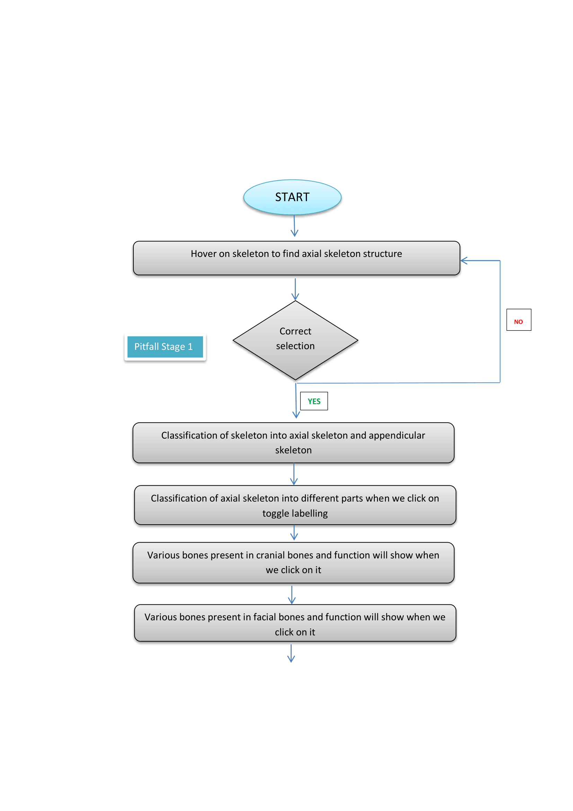
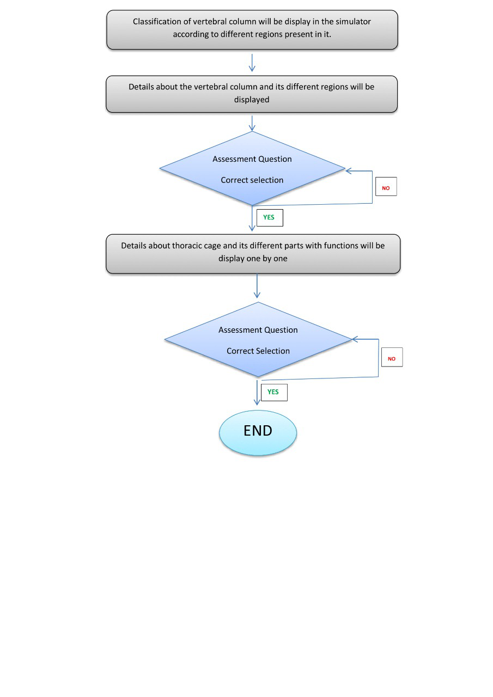
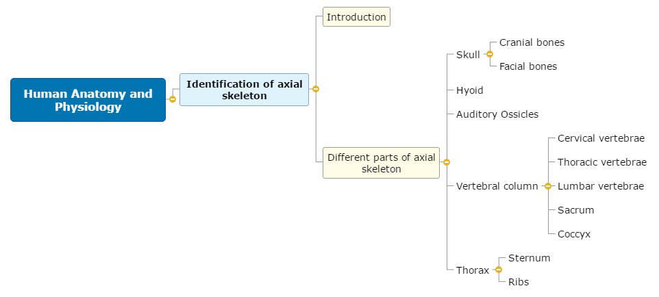
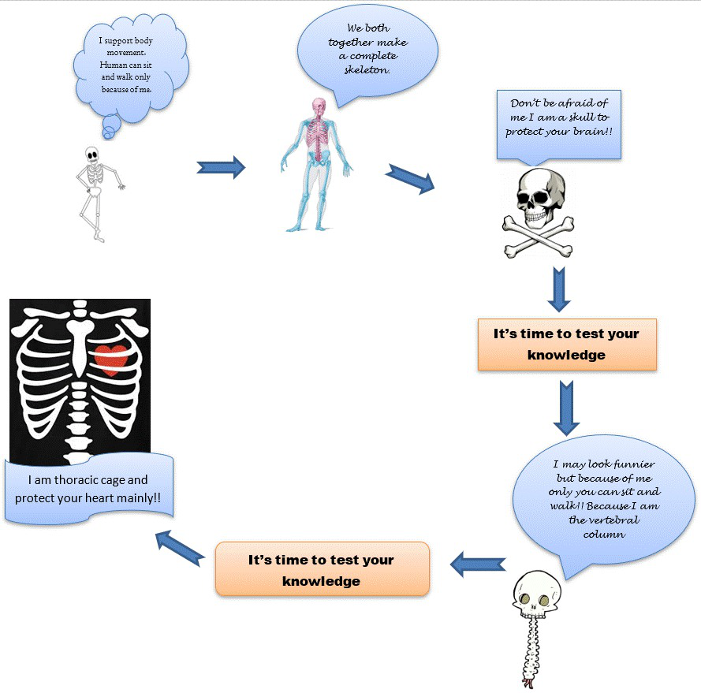

## Storyboard (Round 2)

Experiment 1: Identification of axial bones

### 1. Story Outline:

The story of this virtual lab development is that many concepts are taught in the class. A concept of axial and appendicular skeleton is also taught. So, we thought of making the experiment based on the objective that students should not only be able to remember but also understand as well as apply their learned concept to identify various bones of axial skeleton. The axial skeleton mainly comprises of the following structures like skull, vertebral column and thoracic cage. The skull has 22 bones (8 cranial bones and 14 facial bones). These 22 bones form the framework of our head and face. We would like the user to know that which of these bones form the framework. 
So, the simulator is made in such a manner that the students can click on each bone and learn about its position/location and some features of the bone. The simulator not only teaches but also assess the understanding of the students. In similar manner, bones of vertebral column divided into cervical vertebrae, thoracic vertebrae, lumbar vertebrae, sacrum and coccyx are taught. Similarly, the bones of thoracic cage are also demonstrated. There are click buttons available at various places in the simulator which needs to be pressed in order to conceptualize the whole experiment.

### 2. Story:

The story starts with the display of a complete skeleton mentioning the name of experiment i.e Identification of axial bones on the top of the screen and the student has to press the button “Start Now” to start the experiment. The first page displays, that shows a skeleton which can be hovered by the students just to make the experiment interesting. A button “Wrong One” will show if the structures are wrongly selected. Then the button “Click Now” appears. The student has to click the button and a skeleton arises showing its classification into axial skeleton and appendicular skeleton. 
Then on next screen, a switch” Toggle labelling” appears and the student has to press this button in order to see all the axial structures of axial skeleton viz skull bones, ossicles (inner ear), hyoid bone, rib cage and vertebral column. On right hand side of the screen, a 360 degree revolution of skull is displayed along with details of skull.  Then the student has to press the next button to see the 8 cranial bones. The student hovers on each bone to study the details of each bone. Then the student presses the next button and a screen showing 14 facial bones is displayed. The student hovers on each bone to see its exact location and study details of each facial bone. After studying the facial bones, the student has to press the Next button. On pressing the button, quiz assessment questions arises one by one. The student has to click one right option out of four options. If a wrong option is pressed, red colour gets displayed in the background of the option and if right option is pressed, green colour will display and the student can further proceed to the next question. If the student wants to review the concepts, then he can press the back button. Likewise, 3 questions have to be attempted before going to the next axial structure i.e vertebral column. In the next screen, curves of vertebral column shall be shown and student has to click the button to see various vertebrae present in the vertebral column. On pressing next, student will understand the functions of vertebral column. This will be followed by assessment question. In the similar manner, like earlier, red and green colour displays on attempting wrong and right answers respectively. If the student wants to review the concepts, then he can press the back button. Then the student can proceed to the next axial structure i.e thoracic cage by clicking the next button. The student shall click the button and can see the features of sternum and ribs. In the last, assessment on thoracic cage is done in the similar manner as done in earlier questions. Finally, the “End” button as well as a “Restart” button appears after the experiment gets over. 

#### 2.1 Set the Visual Stage Description:
1. The virtual lab experiment starts with showing the aim of experiment and full skeleton and a button “Click Now” is available for moving forward. 
2. A display of full skeleton is available on which user has to hover on, to find axial structures. and then “Click Now” appears.
3. “Toggle Labeling” button appears on which user has to click to see different bones of axial skeleton. On the same screen, 360-degree revolving skull is showing on right side of the screen. Just below this, “More information about Skull” is available and at the right-side corner, “Next” button is showing.
4. On next screen, a picture of 8 cranial bones of the skull is showing and below this “Hover on bone” is showing. So, the user has to click on the name of each bone to study details of the bones. At the right-side corner, “Next” button is showing.
5. On next screen, a picture of 14 facial bones of the skull is showing and below this “Hover on bone” is showing. So, the user has to click on the name of each bone to study details of the bones. At the right-side corner, “Next” button is showing.
6. On next screen, quiz question is available to test the knowledge of the students. 2 quiz questions are showing each with four options. If student clicks the right option, green colour displays and if student clicks the wrong option, red colour displays. At the right-side corner, “Next” button is showing.
7. On next screen, question asking to identify the part is showing along with the figure. The question has four options. If student clicks the right option, green colour displays and if student clicks the wrong option, red colour displays. At the right-side corner, “Next” button is showing.
8. On next screen, there are 2 pictures, one showing curves of Vertebral column and second showing the vertebrae of vertebral column. Below this “Hover on bone” is showing. So, the user has to click the name of each bone to study details. At the right-side corner, “Next” button is showing.
9. On next screen, 360 degree revolving vertebral column along with the details of vertebral column including functions of vertebral column are displayed. At the right-side corner, “Next” button is showing.
10. On next screen, quiz question is available to test the knowledge of the students. A quiz question is showing with four options. If student clicks the right option, green colour displays and if student clicks the wrong option, red colour displays. At the right-side corner, “Next” button is showing.
11. On next screen, thoracic cage is displayed. Below this “Hover on bone” is showing. So, the user has to click on the name of each bone to study details of the bones. On the same screen, 360-degree revolving thoracic cage is showing on right side of the screen. At the right-side corner, “Next” button is showing.
12. On next screen, a quiz question with four options displays and if student clicks the right option, green colour displays and if student clicks the wrong option, red colour displays. At the right-side corner, “End” button is showing. Below End button, a “Restart button” is also available.
13. A back button is available on all the screens so that the review can be done by the user.

#### 2.2 Set User Objectives & Goals:
The aim of the experiment is identification of axial bones. The objectives are: 
1. Students shall be able to understand the following:
(a) Structures of axial skeleton 
(b) Structure of skull, vertebral column and thoracic cage.
(c) The visual difference between axial and appendicular skeleton. 
(d) Features of various cranial and facial bones of skull.
(e) Functions of skull, vertebral column and thoracic cage. 

2. Students shall be able to identify:
(a) the axial skeleton structures.
(b) To identify the cranial bones of skull and identify location.
(c) To identify the bones of face and conceptualize which bone forms what part of the human face.
(d) To identify the bones of vertebral column and identify location/position
(e) To identify the bones of thoracic cage and identify their locations.  

#### 2.3 Set the Pathway Activities:

1. Press the “Start Now” button to start the experiment.
2. Then press “Hover on” button to see structures of skeleton.
3. “Click Now” button does not appear till the user does not hover on axial skeleton. 
4. After clicking “Click Now” button, a complete skeleton arises showing its classification into axial skeleton and appendicular skeleton.
5. Switch on “Toggle labelling” to show first the structures of axial skeleton.
6. Press “Next” button to see the cranial bones. 
7. Hover on the name of each cranial bone to see its details.
8. Click “Next” button to see the facial bones
9.  Hover on the name of each facial bone to see its details.
10.  Then Press “Next” button to see the assessment question.
11. Student has to click the right option out of four options given on the screen.
12.. If student attempted the correct option, green colour will be displayed. If student attempted the wrong option, red colour will be displayed.
13. Then click “Next” button. Likewise, more questions will be displayed
14. Click the “Next” button to see different vertebraes of vertebral column.
15. Click “Next” button to see functions of vertebral column.
16. Click “Next” to see the assessment question related to vertebral column.
17. Student has to enter the options & red colour/green colour shall be displayed according to the options.
18. Click “Next” button to see bones of thoracic cage and its parts and functions.
19. Click “Next” to see the assessment question with respect to thoracic cage.
20. Student has to click the right option out of four options given on the screen.  If student attempted the correct option, green colour will be displayed. If student attempted the wrong option, red colour will be displayed.
21. Back button is available on all the screens to review the concepts.
22. The “End” button appears and also a “Restart” button appears after the experiment ends. 

##### 2.4 Set Challenges and Questions/Complexity/Variations in Questions:

1. The students has to label the structure of skeleton where the arrow points.

2. The cranium comprised of:  
A. Zygomatic bones  
<b> B. Parietal bones </b>  
C. Temporal bones  
D. Palatine bones   

3.  Which bones form the posterior part of head? 
A. Frontal bone  
<b> B. Occipital bone </b>  
C. Temporal bones  
D. Parietal bone   

4. ______ makes up about 2/5th of total height of human being and protects our spinal cord.  
A. Thoracic cage  
B. Skull  
<b> C. Vertebral column </b>  
D. None of the above    

5. The superior part in sternum is  
<b> A. Manubrium </b>  
B. Xiphoid process  
C. Body  
D. None of the above.  

##### 2.5 Allow pitfalls:
We have designed pitfalls in the form of some assessment questions. In case the student does not attempt the question correctly, red colour displays. There is a back button where the student can go back and clear their concepts.

##### 2.6 Conclusion:
If the student goes carefully through the whole experiment and is understanding correctly, then the total time needs to complete the whole experiment should be around 40 minutes. This can be bifurcated in the following sections.
1. Understanding of axial skeleton takes time: 5 minutes
2. Understanding skull bones will take time: 15minutes    
3. Understanding of vertebral column will take: 10 minutes
4. Understanding of thoracic cage will take: 5 minutes
5. Attempting of assessment questions shall take: 5 minutes

##### 2.7 Equations/formulas: NA

### 3. Flowchart 4

 
link to flow chart Here :<a href="flowchart/flowchart.png"> [here]</a>
 

### 4. Mindmap:

 Link to mindmap here : <a href="mindmap/mindmap.png"> [here]</a>
  
 
### 5. Storyboard :

Storyboard: <a href="storyboard/storyboard.png"> [here]</a>
Link to storybaord (.gif file ) here : <a href="storyboard/storyboard.png"> [here]</a> 
