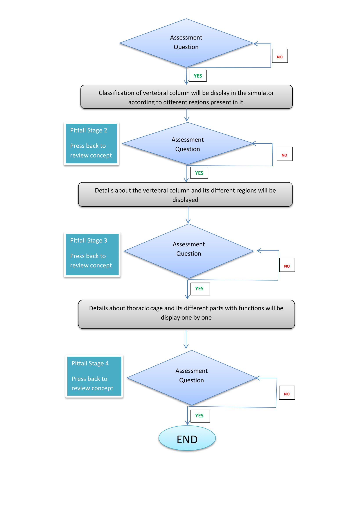
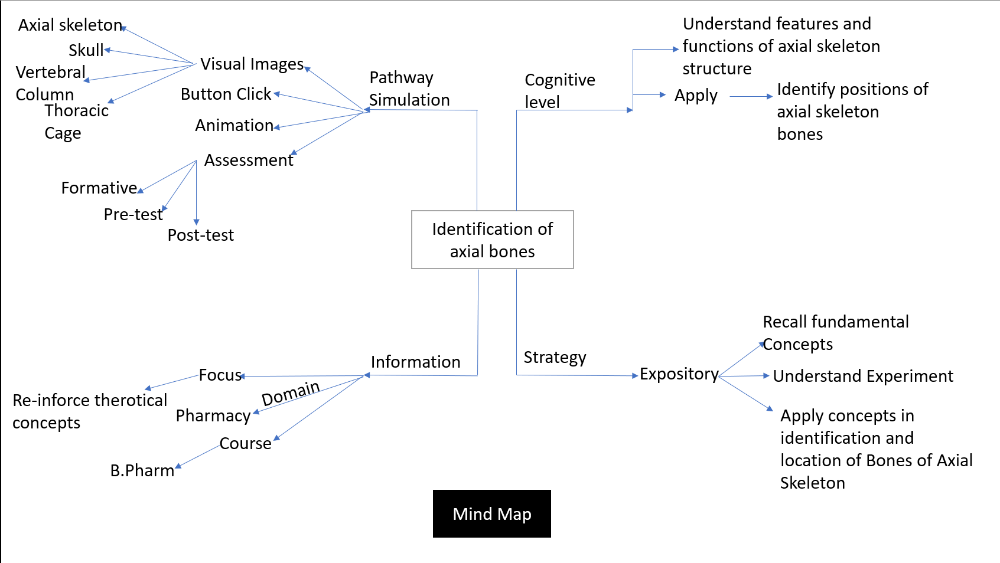

## Storyboard (Round 2)

Experiment 1: Identification of axial bones

### 1. Story Outline:

The story of this virtual lab development is that many concepts are taught in the class. A concept of axial and appendicular skeleton is also taught. So, we thought of making the experiment based on the objective that students should not only be able to remember but also understand as well as identify various bones of axial skeleton. The axial skeleton mainly comprises of the following structures like skull, vertebral column and thoracic cage. The skull has 22 bones (8 cranial bones and 14 facial bones). These 22 bones form the framework of our head and face. We would like the user to know that which of these bones form the framework. 
So, the simulator is made in such a manner that the students can click on each bone and learn about its position/location and some features of the bone. The simulator not only teaches but also assess the understanding of the students. In similar manner, bones of vertebral column divided into cervical vertebrae, thoracic vertebrae, lumbar vertebrae, sacrum and coccyx are taught. Similarly, the bones of thoracic cage are also demonstrated. There are click buttons available at various places in the simulator which needs to be pressed in order to conceptualize the whole experiment.

### 2. Story:

The story starts with the display of a complete skeleton mentioning the name of experiment i.e Identification of axial bones on the top of the screen the student has to press the button “Start Now” to start the experiment. The first page displays, that shows a skeleton which can be hovered by the students just to make the experiment interesting. A button “Wrong One” will blink if the structures are wrongly selected. Then the button “Click Now” appears. The student has to click the button and a skeleton arises showing its classification into axial skeleton and appendicular skeleton. 
Then on next screen, a switch” Toggle labelling” appears and the student has to press this button in order to see all the axial structures of axial skeleton viz skull bones, ossicles (inner ear), hyoid bone, rib cage and vertebral column. On right hand side of the screen, a 360 degree revolution of skull is displayed along with details of skull.  Then the student has to press the next button to see the 8 cranial bones. The student hovers on each bone to study the details of each bone. Then the student presses the next button and a screen showing 14 facial bones is displayed. The student hovers on each bone to see its exact location and study details of each facial bone. After studying the facial bones, the student has to press the Next button. On pressing the button, quiz assessment questions arises one by one. The student has to click one right option out of four options. If a wrong option is pressed, a warning box will be shown and if right option is selected, then the student can further proceed to the next question. Likewise, 3 questions have to be attempted before going to the next axial structure i.e vertebral column. The student will not be able to proceed unless and until all questions are attempted correctly. In the next screen, curves of vertebral column shall be shown and student has to click the button to see various vertebrae present in the vertebral column. On pressing next, student will understand the functions of vertebral column. This will be followed by assessment question. In the similar manner, like earlier, student has to give the correct option to proceed further to the next axial structure i.e thoracic cage. The student shall click the buttons and can see the features of sternum and ribs. In the last, assessment on thoracic cage is done in the similar manner as done in earlier questions. Finally the end button appears after the experiment gets over. 

#### 2.1 Set the Visual Stage Description:
Describe here : (guide When a user lands up into a simulator, the visual stage is the first thing that user comes across. The visual stage should include all the elements to be seen by a user on an imaginary canvas.  (This should NOT include any drawings. ) )

#### 2.2 Set User Objectives & Goals:
The aim of the experiment is identification of axial bones. The experiment is carried out with the following objectives and goals
1. To understand the classification of axial and appendicular skeleton. 
2. To identify the axial skeleton structures.
2. To identify the bones of cranium and understand its function
3. To identify the bones of face and conceptualize which bone forms what part of the human face.
4. To identify the bones of vertebral column and understand the functions of vertebral column
5. To identify the bones of thoracic cage and understand the functions of thoracic cage. 

#### 2.3 Set the Pathway Activities:

1. Press the “Start Now” button to start the experiment.
2. A button “Wrong One” will blink if the structures are wrongly selected.
3. A student has to click the button to display the skeleton. A skeleton arises showing its classification into axial skeleton and appendicular skeleton
4. Switch on” Toggle labelling” to show first the structures of axial skeleton.
5. Press “next” button to see the cranial bones. 
4. Hover on each cranial bone to see its details.
5. Click “Next” button to see the facial bones
6.  Hover on each facial bone to see its details.
7.  Then Press “next” button to see the assessment question.
8.  Student has to click the right option out of four options given on the screen.
9. If student attempted the correct option, next button will show, otherwise warning box will be displayed.
10. Student cannot proceed unless and until correct option is presented.
11. Then click “next” button.
12. Another assessment question arises and student has to attempt one of the option.
12. If student attempted the correct option, next button will show, otherwise warning box will be displayed. If correct option shows, then go to the “Next” button.
13. Another question comes on the screen and the student has to attempt it. If correct option shows, then go to next button
14. Click the button to see vertebrae of vertebral column.
15. Click “next” button to see functions of vertebral column.
16. Click next to see the “Assessment question” related to vertebral column.
17. Student has to enter the correct option like in earlier questions to proceed further.
18. “Click next” button to see bones of thoracic cage.
19. Click next button to see the functions of thoracic cage.
20. Assessment question is displayed with respect to thoracic cage.
21. Student has to click the correct option.
22. The end button appears and the experiment ends. 

##### 2.4 Set Challenges and Questions/Complexity/Variations in Questions:

1. The students has to label the structure of skeleton where the arrow points.

2. The cranium comprised of:
A. Zygomatic bones
<b> B. Parietal bones </b>
C. Temporal bones
D. Palatine bones

3.  Which bones form the posterior part of head?
A. Frontal bone
<b> B. Occipital bone </b>
C. Temporal bones
D. Parietal bone

4. ______ makes up about 2/5th of total height of human being and protects our spinal cord.
A. Thoracic cage
B. Skull
<b> C. Vertebral column </b>
D. None of the above 

5. The superior part in sternum is
<b> A. Manubrium </b>
B. Xiphoid process
C. Body
D. None of the above. 

##### 2.5 Allow pitfalls:
The assessment questions are asked in the simulator to check whether the student is interacting and understanding the demonstration or not. If the student is not attentive, he/she will definitely not be able to answer the question correctly, then a warning box will appear and unless and until the student gives the right answer, he/she will not be able to proceed further in the experiment. 

##### 2.6 Conclusion:
1. Students understand the structures of axial skeleton.
2. Students can identify bones of skull ( i.e cranium and face) and their unique function.
3. Students can identify bones of vertebral column and functions of vertebral column.
4. Students can identify bones of thoracic cage and functions of thoracic cage.

##### 2.7 Equations/formulas: NA

### 3. Flowchart 4

 
link to flow chart Here : Store in the  /flowchart folder within Round2 folder in your repo
 
(guide :The lab proposer should extract logic from the story, prepare a flowchart from the story narration and write the algorithm to execute the black box.  use Google Drawings https://docs.google.com/drawings/ (send the link to your flowchart and also attach .png by exporting it )

### 4. Mindmap:

 Link to mindmap here : Store the mindmap in both .mm & .png extension in the  /mindmap folder and include link of only .pdf verison here
  
 (guide : An elaborate mind map (connecting all the points in the experiment flow ) should be prepared and submitted by the lab proposer. The mind map should be a clear and detailed document that takes into account all minute intri5acies involved in the development of virtual lab. The mindmap should be self-content and any developer across the globe should be able to code it with all those details. using only FreeMind http://freemind.sourceforge.net/wiki/index.php/Main_Page (send the .png file and also the original .mm extension project file. )

### 5. Storyboard :

Storyboard: <a href="Storyboard/storyboard.gif"> [here]</a>
Link to storybaord (.gif file ) here : 
(guide: This document should include sketching and description scene wise (duration, action, description). Software to be used for storyboarding : https://wonderunit.com/storyboarder/ (Its a FOSS tool) . tutorial on how to use it https://www.youtube.com/watch?v=LAeCEpG0KX4
